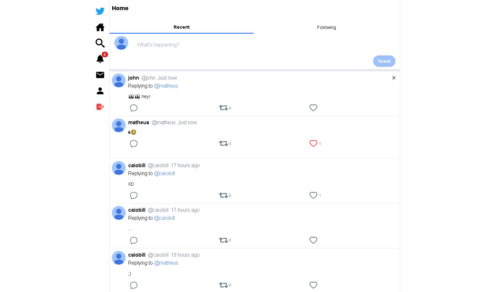
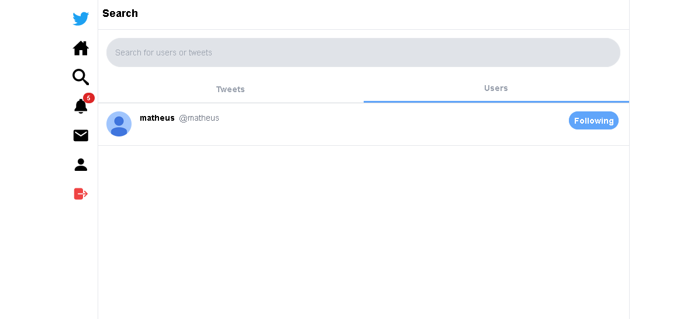
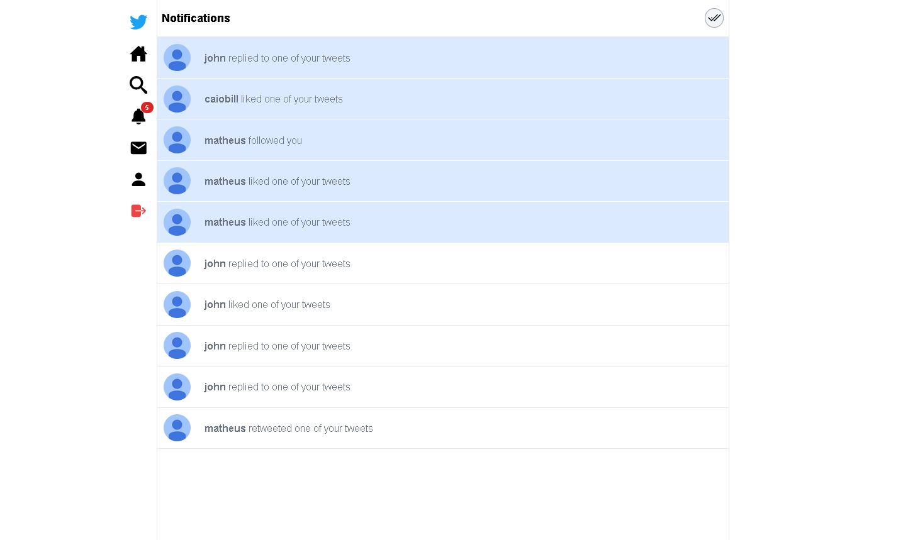
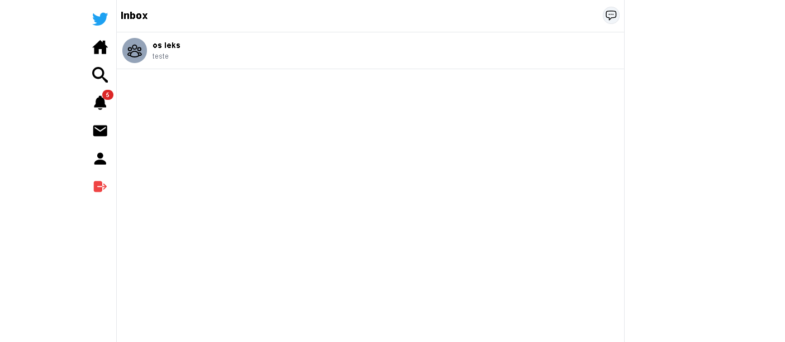
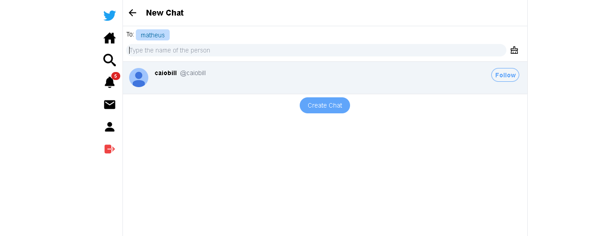
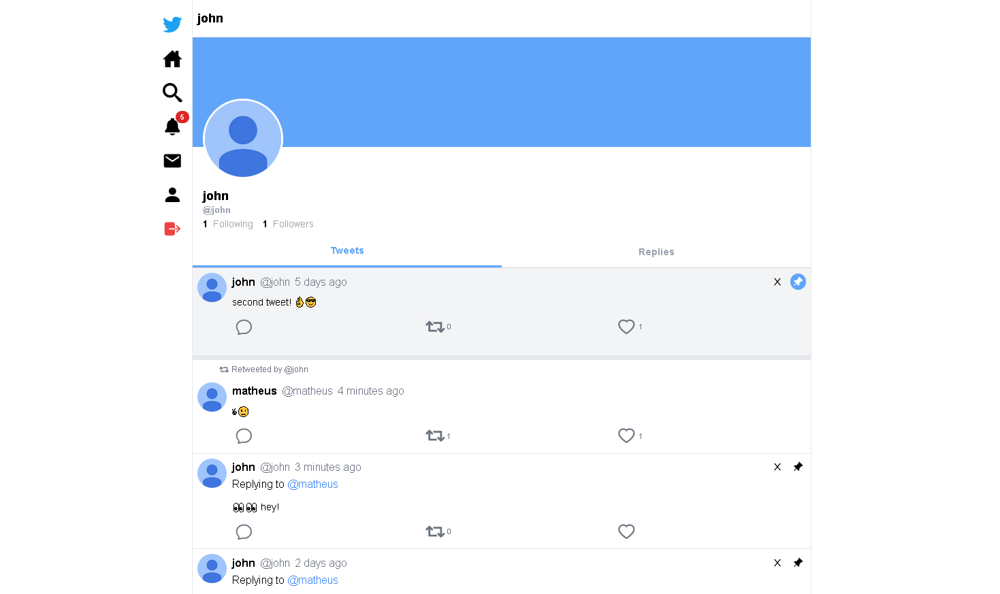
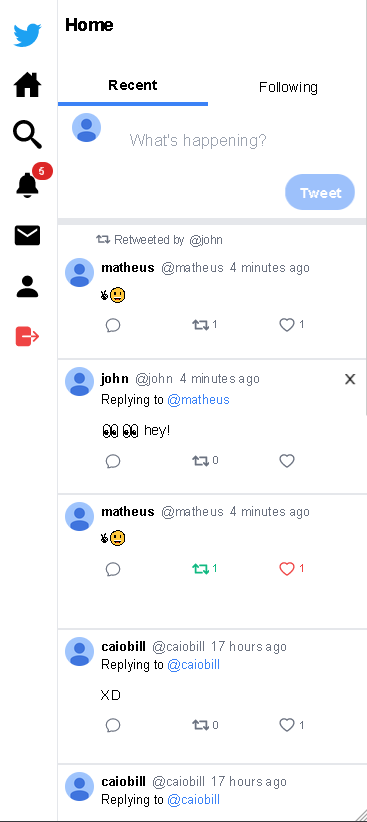
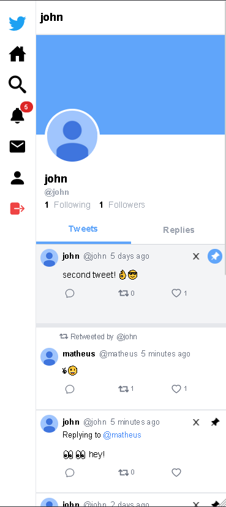

# Fullstack Twitter Application

## Application

    The application allows account creation, creation of tweets, likes, replies and retweets.
    It's also possible to follow other users, view only tweets from those you are following,
    real time chat and real time notifications.

## Technologies

This application was developed with **`NextJs`**, **`Typescript`**, **`NextAuth`**, **`TailwindCSS`** and **`SocketIO`**.

## Backend

[Link to backend](https://github.com/matheusjustino/twitter-backend)

## Application Screenshots

